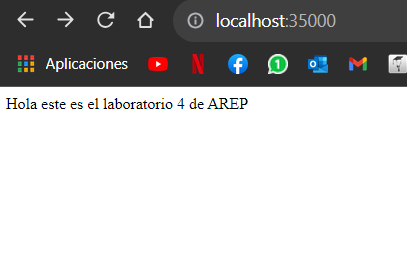
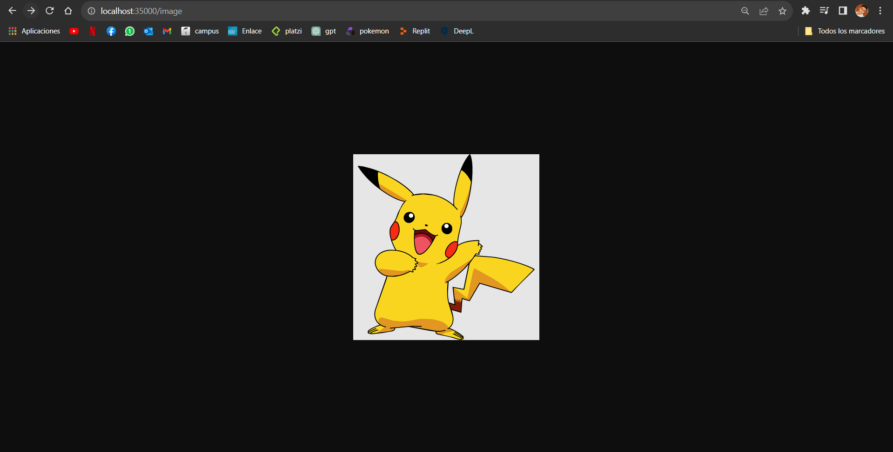
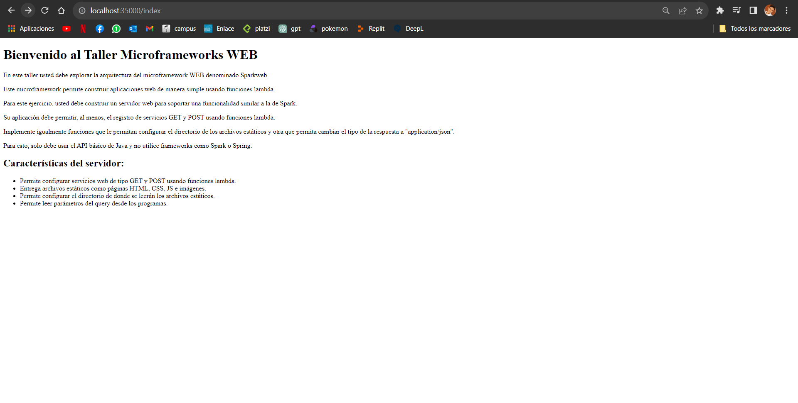

# TALLER DISEÑO Y ESTRUCTURACIÓN DE APLICACIONES DISTRIBUIDAS EN INTERNET - Camilo Cantillo T
## Para este taller los estudiantes deberán construir un servidor Web (tipo Apache) en Java. El servidor debe ser capaz de entregar páginas html e imágenes tipo PNG. Igualmente el servidor debe proveer un framework IoC para la construcción de aplicaciones web a partir de POJOS. Usando el servidor se debe construir una aplicación Web de ejemplo. El servidor debe atender múltiples solicitudes no concurrentes.

### Inicialización:
Estas instrucciones te ayudarán a obtener una copia del proyecto en funcionamiento en tu máquina local para desarrollo y pruebas. Consulta la sección de "Despliegue" para obtener notas sobre cómo implementar el proyecto en un sistema en vivo.

### Prerequisitos:
Cosas que necesitas instalar y cómo hacerlo.

- Java Development Kit (JDK)
- Maven
- Git

### Instalando el proyecto:

1. Para tener una copia en local del repositorio debemos abrir la termial y estar ubicado en la carpeta que queremos clonar el repositorio, seguido a esto utilizamos el comando:

```
https://github.com/CamiloCanta/AREP_lab4.git
```

2. Preferencialmente, solemos abrir el proyecto en una IDE, por lo cual abriremos el proyecto en esta misma, abriremos la terminal y ejecutamos el codigo:
```
mvn clean install
```

3. Corremos la mainClass que se encentra en la ruta edu/escuelaing/arep/app/webApp y la clase se llama App

4Ya ejecutada la aplicación, procedemos a abrir el navegador de nuestra preferencia y usamos la siguiente URL:

```
http://localhost:35000
```
4. Una vez en la página podemos realizar busquedas de los archivos










### Documentación:
Con el siguiente comando veremos la documentación:
```
mvn javadoc:javadoc
```

### Contrucción:
- Java
- Maven
- Git

### Autor:
Camilo Andres Cantillo Tatis

